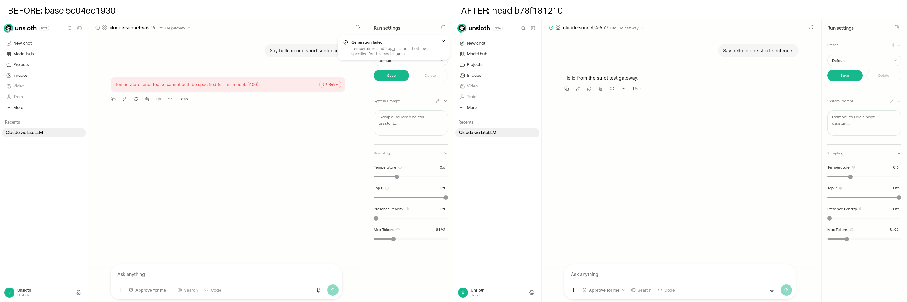

# PR 10934 verification

## Before

At merge base `5c04ec19305ecb5f0153c5b4d806a9d7e6e4422d`, the actual Studio frontend sent `temperature: 0.6` and `top_p: 1.0` with Top P displayed as Off. The strict HTTP gateway returned 400 and Studio displayed the conflict. Reproduced independently in Chromium and Firefox.

## After

At original head `b78f181210e8d17466368f9507db2b8573fb17a0`, the same browser scene omitted `top_p`, retained `temperature: 0.6`, received HTTP 200, and displayed the gateway reply. Final head `5222bccffeb69119a40d90b420191b480d47c682` changes only the backend regression tests; its production code and frontend are identical to the photographed head.

## Verdict

The reported omission bug is real and the production fix works in the executed scenarios. Code review found no additional production defect within this PR's scope.

## Regression results

| Check | Result |
| --- | --- |
| Original backend tests on base | 4 expected failures, 1 pass |
| Original backend tests on original head | 5 passed |
| Final omission tests on base | 4 expected failures, 3 passes |
| Final omission and related sampling suites on repaired head | 65 passed |
| Original omission and related sampling suites on prospective merge `762e505f49d7d5567bfe7d8fa60764b023cd5f01` | 63 passed |
| Frontend sampling/research tests on base with head's test overlay | 2 expected failures, 16 passes |
| Frontend sampling/research tests on head | 18 passed |
| Separate frontend production builds at base/head | Both passed |
| Repository formatter and pinned Ruff lint | Passed |

The backend regression command covers `test_external_top_p_omission.py`, `test_external_provider_sampling_forwarding.py`, `test_external_provider_sampling_over_the_wire.py`, and `test_sampling_resolution.py`. The frontend command covers `external-sampling-payload.test.ts` and `research-inference-request.test.ts` with Node's test runner. Explicit API values 0, 0.9, and 1 remain forwarded; non-streaming completion and connection-ping success are asserted.

The additional browser regression sends `top_p=0.9` and observes HTTP 400, switches the slider to Off, retries successfully with HTTP 200 and no `top_p`, then reloads and waits for the restored Off value. See `roundtrip-facts.json` and the labelled screenshots.

## Compatibility

Ubuntu 26.04.1 LTS x86_64; Python 3.12.13; Node 26.8.2; uv 0.12.1; Playwright 1.62.0; Chromium 151.0.7922.34 and Firefox 153.0; 1440×900 viewport. Dependencies and detailed metadata accompany this report. Base, head, merge and fix use isolated Python environments with identical resolved runtime dependencies. Browser scenarios use separate frontend builds, application homes and processes in a credential-free Bubblewrap sandbox.

## UI evidence

Both composites were opened and inspected. They show the Off control alongside the base error and head reply. The scene uses the real Studio frontend and backend with a loopback HTTP gateway that enforces the reported temperature/top_p conflict. JSON facts record the actual outgoing fields and gateway status.

## Fix

Commit `5222bccffeb69119a40d90b420191b480d47c682` repairs `studio/backend/tests/test_external_top_p_omission.py`. Its gateway previously returned SSE to non-streaming requests. One test swallowed the decoding exception; the connection test passed with `success=False`. The gateway now returns JSON for non-streaming calls, both tests assert successful results, and explicit-value checks cover 0, 0.9 and 1 plus the rejection response.

## Failure controls

Adding only a success assertion to the original connection test produced `Connection failed: Expecting value: line 1 column 1 (char 0)`, independently proving the false-positive test. The repaired fixture and assertions pass. The base A/B failures above are intentional negative controls and fail for the original omission defect.

Initial recovery-scene attempts failed on a disabled Send button, the numeric editor display, and an immediate assertion before settings hydration. The final scene uses the visible Retry button, the slider End key, and a waited reload assertion; it passes. Those development logs are preserved alongside the final result.
