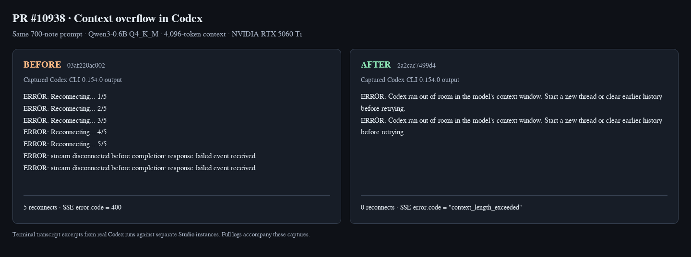

# PR 10938 verification

Reviewed head: `2a2cac7499d45c7bea8d409a99880ad519f64430`
Merge base: `03af220ac0023ab846727397b3a1de9efa0aec42`
Prospective merge: `2910397423eb848dcfe285807d7947d38b17bb5f`

## Before

Six new error-code tests fail on the merge base because the SSE payload contains numeric codes. A real Codex CLI 0.154.0 request against Studio with Qwen3-0.6B Q4_K_M and a 4096-token context retries five times and ends with `stream disconnected before completion: response.failed event received`.

## After

The same prompt on the original PR head produces `context_length_exceeded`, zero reconnects, and `Codex ran out of room in the model's context window. Start a new thread or clear earlier history before retrying.` Both overflowing Codex runs exit 1, as expected for failed requests.

## Verdict

Real issue, fixed by the original PR. No additional code defect confirmed.

## Regression risk

Focused Responses, translation, history and admission suites: base **454 passed**, head **460 passed**, prospective merge **460 passed**. Each combined suite reports one Starlette/AnyIO deprecation warning. The six new tests independently fail on base for their intended assertions. Successful streaming and non-streaming requests pass on both live servers. Both also complete a streamed `lookup({"city":"Paris"})` function call and a follow-up request with the function result. Ruff 0.6.9 passes; the repository formatter leaves the changed files identical; `git diff --check` passes.

## Compatibility

Linux x86_64, Python 3.12.13, Codex CLI 0.154.0, NVIDIA RTX 5060 Ti, driver 595.91.07, llama.cpp `b10909-mix-bea84f7` CUDA 13 newer build. Separate checkouts, Python environments and Studio homes use identical pinned dependencies. Both live llama-server processes allocate 1012 MiB on the GPU. An initial CPU run also reproduces the same before/after behavior; missing CUDA runtime libraries were installed within the disposable workspace before the GPU run.

## UI evidence

These are screenshots of actual captured terminal transcript excerpts, rendered with Playwright Chromium 151.0.7922.34 at 1440 x 520. The composite was opened and inspected: five reconnects and a generic stream failure before, zero reconnects and the context-window message after. Full terminal output is in the archive.



[Before](codex-base.png) · [After](codex-head.png) · [Logs, pinned dependencies, environment and reproduction scripts](verification.zip)

## Fixes

Zero additional commits. No source repair was needed.

## Gaps

No unresolved defect was found within this PR's scope.

## Reproduction

`verification.zip` includes the isolated sandbox launcher, identical-input live probes, environment details, model SHA-256, pinned dependencies, raw SSE and sanitized server/terminal logs. The sandbox exposes only the disposable task folder, system runtime files and GPU devices; it receives no host credentials.

Run the same five files from `studio/backend` in each pinned checkout:

```sh
../../.venv/bin/python -m pytest \
  tests/test_responses_tool_passthrough.py \
  tests/test_responses_api.py \
  tests/test_openai_responses_translation.py \
  tests/test_responses_history_guard.py \
  tests/test_llama_admission.py -q --tb=short --timeout=45
```

For the negative control, copy the head's `test_responses_tool_passthrough.py` to `probes/test_pr_responses.py`, then:

```sh
PYTHONPATH=/task/base/studio/backend base/.venv/bin/python -m pytest \
  probes/test_pr_responses.py -q --tb=short \
  -k 'string_code or unreachable_upstream or server_is_overloaded'
```

The live scripts call Studio's production launcher, load the real model through its authenticated API, then exercise `/v1/responses` and the real Codex binary. `serve.py` is run with each checkout's Python; `probe_live.py` and `probe_tools.py` issue the test requests. The CUDA runtime library directory is passed through `LD_LIBRARY_PATH` for the GPU launch.

The error mapping also matches [Codex 0.154.0's SSE parser](https://github.com/openai/codex/blob/rust-v0.154.0/codex-rs/codex-api/src/sse/responses.rs#L417).
