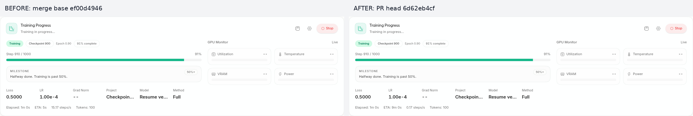

# PR #11297 verification

The resumed ETA and throughput fix passes independent Linux verification. No source repair was needed.

- Base: `ef00d4946731d2cb9bed2982f1a24346843e7e19`
- Head: `6d62eb4cf9066a0ec78410a31b69d0a5c9208462`
- Prospective merge: `47b04e2fe7087bd9aa349d2b4845a33252d9961d`
- Review mirror: `1a013007b98a4cc5bc2c572bbaeb70f49ad8fcb6`

| Check | Observed result |
| --- | --- |
| Relevant backend slice | Base 171 passed; head, prospective merge and mirror each 177 passed |
| Head regression tests on base product code | 5 failed, 26 passed; failures identify resumed ETA, initial ETA, baseline propagation and SSE field |
| Focused head suite | 31 passed on Transformers 5.17.0; 31 passed on 4.57.6 |
| Frontend training tests | Base 241 passed; head and prospective merge each 244 passed |
| Independent frontend compatibility | 2 passed, including 10,000 arithmetic windows and parser/store missing, null, explicit-zero and job-reset behavior |
| Extracted MLX step callback | 1,000 incorrect resumed ETAs on base; zero incorrect on head and prospective merge, same inputs |
| Frontend typecheck and production build | Pass on base, head and prospective merge |
| Ruff, changed Python files | Pass |
| GPU checkpoint resume | Real Transformers Trainer, tiny randomly initialized two-layer Llama, six optimizer steps, gradient accumulation two, checkpoint at three, then resume; uninterrupted and resumed final tensors and losses match exactly on base, head and merge |
| GPU dependency compatibility | Checkpoint resume also passes with Transformers 4.57.6; main GPU matrix uses 5.17.0 and torch 2.10.0 |
| GPU A/B regression comparison | Final tensors match exactly across base, head and prospective merge |
| Browser verification | 30 desktop scenarios and six mobile views in Chrome 153.0.8010.52, Edge 153.0.4234.48 and Firefox 155.0; zero page errors and no horizontal overflow at 390px |

Ubuntu 26.04.1 LTS x86_64, Python 3.12.13, Node 26.8.2, Playwright 1.63.0, NVIDIA RTX 5060 Ti 16 GB. Dependencies, application homes, caches and browsers were isolated under a disposable task root. PR code ran in bubblewrap without host credentials. Python resolutions are attached.

The browser scene mounts the actual `LiveTrainingView` in a router with real styles. It consumes progress frames generated by the actual callback, worker event adapter, backend handler and SSE route under controlled clocks. Unrelated run metadata and GPU telemetry APIs are fixtures. The GPU experiment runs the actual CUDA and embedding progress callbacks inside a real Transformers training loop; model-loader imports are stubbed, and the tiny model is created directly. This evidence does not claim a full Studio History-click lifecycle or native MLX training.

The backend tests use their existing model-loader stubs. The bootstrap retains those imports for later embedding-summary callbacks and loads ordinary backend/update modules before tests install partial stubs. This resolves collection/import-order failures without changing product code or assertions; the identical bootstrap is used for base and head.

## Observed numbers

At step 910/1000, resumed from 900, after 60 seconds:

| Value | Base | Head |
| --- | --- | --- |
| Overall progress | 91% | 91% |
| ETA | 5.934 seconds, displayed as 5s | 540 seconds, displayed as 9m 0s |
| Throughput | 15.17 steps/s | 0.17 steps/s |

With an additional 600 seconds of setup before resuming, base includes that time and reports 65.275 seconds remaining; head reports 540 seconds and an elapsed session time of 60 seconds. Fresh-run ETA remains 540 seconds on both. Fresh and legacy payload displays match exactly across the three browsers. A resumed initial frame on head shows unknown ETA and 0.00 steps/s; completion shows 0s ETA and session throughput.



## Commands

The attached scripts run against separate `base`, `head`, `merge` and `mirror` worktrees. `run_checks.py` records the selected backend test files. The negative control overlays only the three head test files onto base in the filesystem sandbox; product sources stay unchanged.

```
python run_checks.py base head merge mirror
python pytest_bootstrap.py -q tests/test_training_progress_callback.py tests/test_training_progress_stream_nan.py tests/test_final_loss_not_average.py
node --experimental-strip-types --test tests/training-*.test.ts
node --experimental-strip-types --test tests/review-session-compat.test.ts
npm run typecheck
npm run build
python gpu_resume.py base
python gpu_resume.py head
python gpu_resume.py merge
python frames.py base
python frames.py head
python browser.py
```

The source PR's original red parity check reported a ten-character chat reasoning-toggle scaffold mismatch that reversed direction across its two repetitions. Its before/after screenshots were inspected; it exercises chat content untouched by this PR. A complete rerun of run `35473739873` was requested and remains queued at evidence publication. The earlier comment's description of an inconclusive timing verdict does not describe this failing job.

References: [Transformers callback contract](https://huggingface.co/docs/transformers/main_classes/callback), [MLX trainer source](https://github.com/unslothai/unsloth-zoo/blob/main/unsloth_zoo/mlx/trainer.py), [original parity run](https://github.com/unslothai/unsloth/actions/runs/35473739873).
