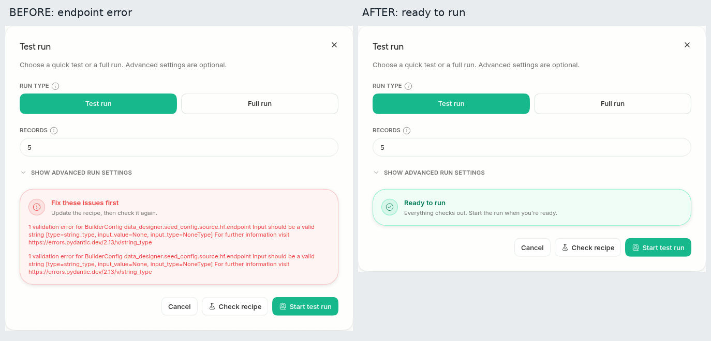

# PR 11300 verification

Original PR: https://github.com/unslothai/unsloth/pull/11300

Base: `768d644036a948441ba80b626c9e747c1fecfbae`.
Head: `7bf15c0fa42c78d8b6f1c547c7ccc84331e7ffd4`.
Prospective merge tested on mirror: `f89b3457c3f105237168efa483940165677fdf81`, with upstream base `606d87e7622064e99fbad70a1a7b9e6f6604b567`.

Linux x86_64, Python 3.13.14 and 3.11.15, uv 0.12.1. Data Designer 0.5.4, Pydantic 2.13.4, FastAPI 0.141.1, pandas 2.3.3, pyarrow 23.0.1, huggingface-hub 1.23.0. Separate worktrees, virtual environments, application homes and browser contexts; PR code executed in a credential-free bubblewrap sandbox. Python 3.11 resolves older supported NumPy/SciPy wheels; both use the same application dependency pins. The constraints cap MCP below 2 and anyio below 4.14. Studio's pyarrow override is applied after Data Designer installation.

## Executed checks

- `python -m pytest studio/backend/tests/test_data_recipe*.py studio/backend/tests/test_account_recipe*.py -q`: base 91 passed; head 92 passed; mirror merge 92 passed; Python 3.11 head 92 passed.
- `python -m pytest studio/backend/tests/test_mcp_stdio_api_key_gate.py -q`: 24 passed.
- The PR's new endpoint regression test, with its source lookup redirected to the chosen checkout, fails on base because the endpoint remains `None`; passes on head.
- `probe.py`: real Hub requests against the five-row `lhoestq/demo1` CSV seed. Null, empty, whitespace, omitted and explicit endpoints; explicit endpoint with a conflicting environment setting; seedless recipe; missing columns; invalid expression; malformed GitHub source; warm repeat; eight validations in four concurrent workers; two-row generation. Base null fails validation, whitespace raises an existing reader error; head resolves both. Head, Python 3.11 and mirror generate exactly two rows with `result=verified`.
- `mirror-endpoint.py`: a real HTTP loopback proxy forwards requests to the public Hub. Validation resolves the null endpoint to the configured loopback address and succeeds; the proxy observes three requests.
- `ruff check` passes on both changed files. The repository formatter with pinned ruff 0.6.9 leaves the final source tree unchanged. `git diff --check` passes.
- Separate `npm ci --ignore-scripts && npm run build` builds on base and head pass.

## Browser evidence

Real Studio `main.app`, production frontend builds, real authentication and Data Designer validator. Same imported recipe, endpoint null, 1440x1000 viewport, light theme, reduced motion. No validator, Hub reader or network response mocks.

| Linux browser | Before | After |
| --- | --- | --- |
| Chrome 153.0.8010.52 | Endpoint string error | Ready to run |
| Edge 153.0.4234.48 | Endpoint string error | Ready to run |
| Firefox 155.0 | Endpoint string error | Ready to run |
| Playwright Chromium 153.0.8010.12 | Endpoint string error | Ready to run |

Each pair includes original full-viewport screenshots, dialog captures, response measurements and a labelled composite. All composites were visually inspected. Both sides return HTTP 200; `valid` changes from false to true and errors from one to zero. The Chromium Start test run action also completed a real background job with exactly two `verified` rows, confirmed through the authenticated status and dataset APIs (`ui-job.json`).

## Reproduction

The scripts use `/task` as the disposable sandbox mount. Install the pinned requirements and the two local Data Designer seed plugins, then run `probe.py base` or `probe.py head` from the relevant checkout. `server.py` mounts that checkout's frontend build and creates a disposable account; the browser scene reads only that account's temporary password. No authentication state or password files are published.

Primary sources: [Data Designer 0.5.4 metadata](https://pypi.org/project/data-designer/0.5.4/), [public test dataset](https://huggingface.co/datasets/lhoestq/demo1).
